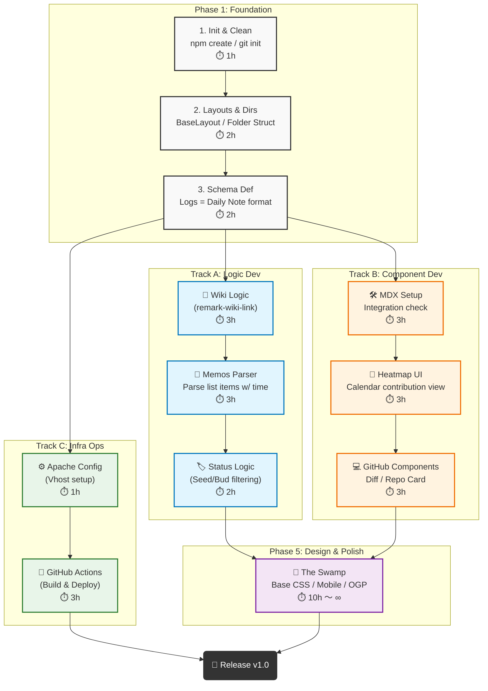

# scrap-blog

A personal scrapbox-like log or blog and digital garden built with Astro. / Astroで構築した、Scrapboxライクなデジタルガーデンもしくはブログ。

---

## 🛠 Tech Stack

- **Framework:** [Astro](https://astro.build)
- **Deployment:** Linux / Apache via GitHub Actions
- **Concept:** Digital Garden (Seed -> Bud -> Evergreen) ?

## 機能

### A. Blog/GitHubモード (Articles)

- **役割:** 完成された成果物、技術的なショーケース。
- **特徴:**
  - **MDXコンポーネント:** Reactコンポーネントを埋め込み可能。
  - **GitHub連携:** 特定リポジトリのRelease Note引用、コミットのDiff表示、言語使用率のグラフ化など。
  - OGP画像をリッチに生成。

### B. Scrapboxモード (Scraps)

- **役割:** 知識のネットワーク、概念の整理。
- **特徴:**
  - **双方向リンク (Wiki Link):** `[[記事タイトル]]` で相互にリンク可能。
  - **ステータス管理:** 記事の成熟度を明示（🌱 Seed / 🌿 Bud / 🌲 Evergreen）。
  - **Backlinks:** その記事にリンクしている記事の一覧を自動表示。

### C. SNSモード (Tweets)

- **役割:** 思考のフロー、作業ログ、独り言。
- **特徴:**
  - タイトル不要（日付がID）。
  - 時系列（降順）のタイムライン表示。
  - Obsidian-Memos likeな表示や管理

## ディレクトリ構成案

```Plaintext
scrap-blog/
├── public/                 # 静的ファイル (favicon, robots.txt)
├── src/
│   ├── components/         # UI部品
│   │   ├── GitHubDiff.astro    # コード差分表示用コンポーネント
│   │   ├── Timeline.astro      # SNS風フィード表示
│   │   └── WikiLink.astro      # 内部リンク処理
│   ├── content/            # 記事データ (Markdown/MDX)
│   │   ├── config.ts       # スキーマ定義 (ここでLogs/Notes/Projectsを定義)
│   │   ├── articles/       # Blogモード用
│   │   ├── scraps/         # Scrapboxモード用
│   │   └── tweets/         # SNSモード用 (ファイル名は日付: 2026-01-05.md)
│   ├── layouts/            # ページレイアウト
│   │   ├── BaseLayout.astro
│   │   └── NoteLayout.astro
│   ├── pages/              # ルーティング
│   │   ├── index.astro     # トップページ (Feed + Random Notes)
│   │   ├── articles/[slug].astro # Blog個別ページ
│   │   ├── scraps/[slug].astro   # Scrapbox個別ページ
│   │   ├── tweets/[...page].astro # SNS個別ページ
│   │   └── rss.xml.js
│   └── styles/
│       └── global.css      # 全体スタイル (CSS Variables活用)
├── astro.config.mjs        # Astro設定 (remark-wiki-link等のプラグイン設定)
├── package.json
└── tsconfig.json
```

## 🛣 Road Map


